# Card Heaven

## Overview

**Card Heaven** is an online trading card marketplace developed as my first full-stack web application during the Web Applications course.

The goal of the project is to provide a platform where users can buy, sell, manage and browse collectible trading cards through a modern web interface.

This project was built from scratch following a complete client-server architecture, covering frontend development, backend development, database management, authentication, file uploads and REST API design.

---

## Features

### User Management

- User registration and login
- Session-based authentication
- User profile management
- Profile image upload
- Account information editing

### Card Marketplace

- Browse available cards
- Search cards by name
- Sort cards by different criteria
- Filter cards by collection/category
- View detailed card information

### Selling Cards

- Create new card announcements
- Upload card images
- Specify card details:
  - Name
  - Author/Vendor
  - Price
  - Rarity
  - Condition
  - Collection
  - Description

### Announcement Management

- View personal announcements
- Edit existing announcements
- Delete announcements
- Update card information and images

### User Experience

- Dynamic content rendering with JavaScript
- Custom modal windows
- Form validation
- Success and error notifications
- Responsive UI design

---

## Technologies Used

### Frontend

- HTML5
- CSS3
- Vanilla JavaScript (ES6)

### Backend

- Java 21
- Spring Boot
- Spring MVC
- Spring Data JPA
- Spring Security
- REST APIs

### Database

- MySQL

### Development Tools

- Maven
- Git
- GitHub
- Visual Studio Code
- IntelliJ IDEA

---

## Architecture

The backend follows a layered architecture based on the separation of responsibilities.

### Controller Layer

Handles HTTP requests and API endpoints.

Examples:

- UserController
- CardController

### Service Layer

Contains the business logic of the application.

Responsibilities:

- Data validation
- Authorization checks
- Business rules
- Coordination between controllers and repositories

### Repository Layer

Handles database access through Spring Data JPA repositories.

Responsibilities:

- CRUD operations
- Query execution
- Entity persistence

### Database Layer

Stores all application data including:

- Users
- Cards

---

## REST API

The application exposes a RESTful API that allows communication between frontend and backend.

### Cards

| Method | Endpoint |
|----------|------------|
| GET | `/api/cards` |
| GET | `/api/cards/{id}` |
| POST | `/api/cards` |
| PUT | `/api/cards/{id}` |
| DELETE | `/api/cards/{id}` |

### Users

| Method | Endpoint |
|----------|------------|
| GET | `/api/users/{username}` |
| PUT | `/api/users/update` |
| POST | `/api/users/register` |
| POST | `/api/users/login` |
| POST | `/api/users/logout` |

---

## File Uploads

The project supports image uploads for:

- User profile pictures
- Trading card images

Images are stored and served by the backend and rendered dynamically in the frontend.

---

## Security Features

The application implements several security-related measures:

- Session-based authentication
- Authorization checks on protected operations
- Ownership validation before editing announcements
- Client-side and server-side validation
- Secure handling of uploaded files

---

## What I Learned

This project represents my first complete web application and allowed me to gain practical experience with:

- Frontend development
- Responsive UI design
- DOM manipulation
- REST API design
- Backend development with Spring Boot
- Database integration with MySQL
- File uploads
- Authentication and session management
- Client-server communication
- Software architecture patterns
- Git and version control

---

## Future Improvements

Potential future enhancements include:

- Google Authentication
- Apple Authentication
- Shopping cart system
- Favorites / Wishlist
- Messaging between buyers and sellers
- Payment integration
- Advanced search filters
- Admin dashboard
- Docker deployment
- Cloud hosting

---

## Screenshots

### Home Page

  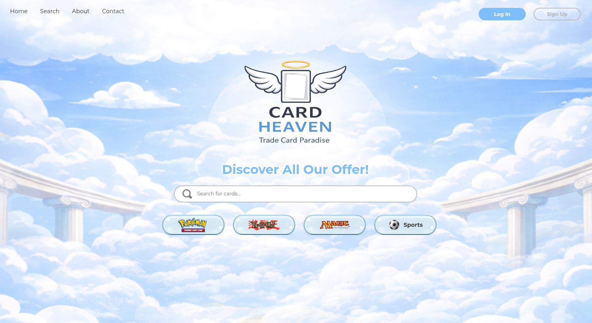
  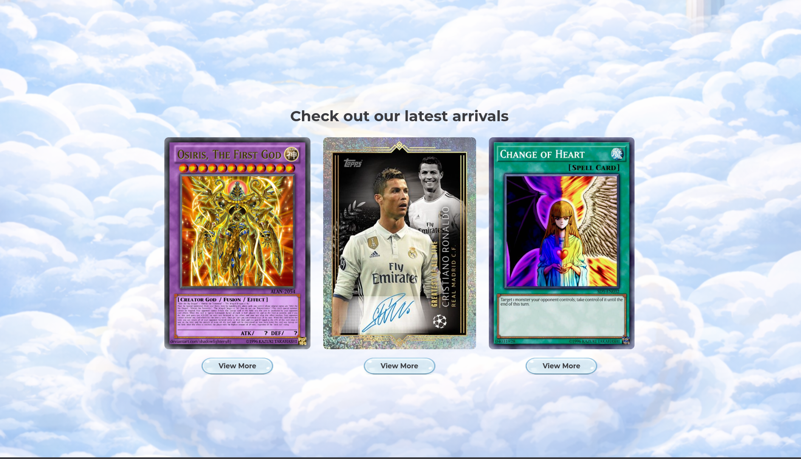
  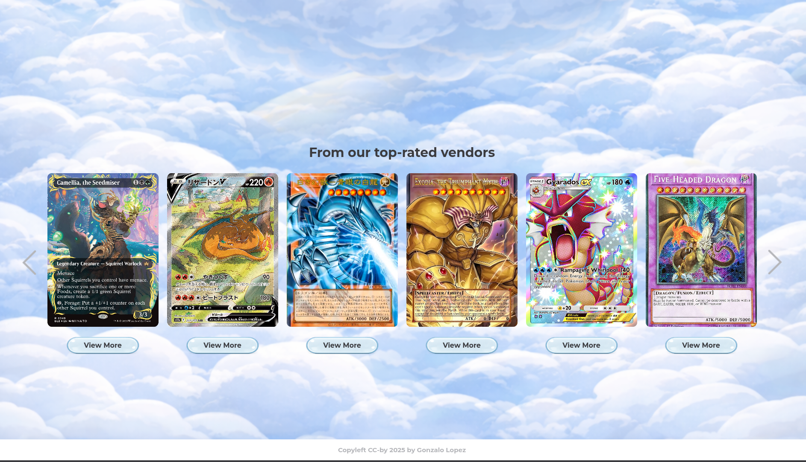
  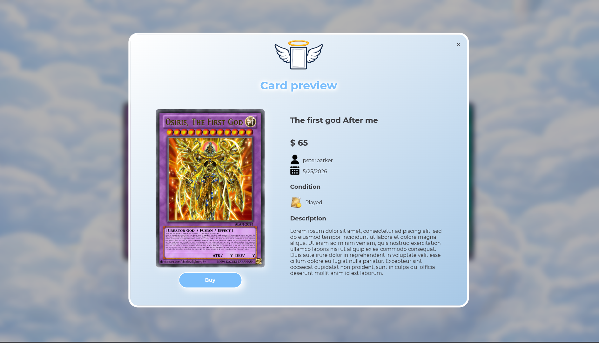
  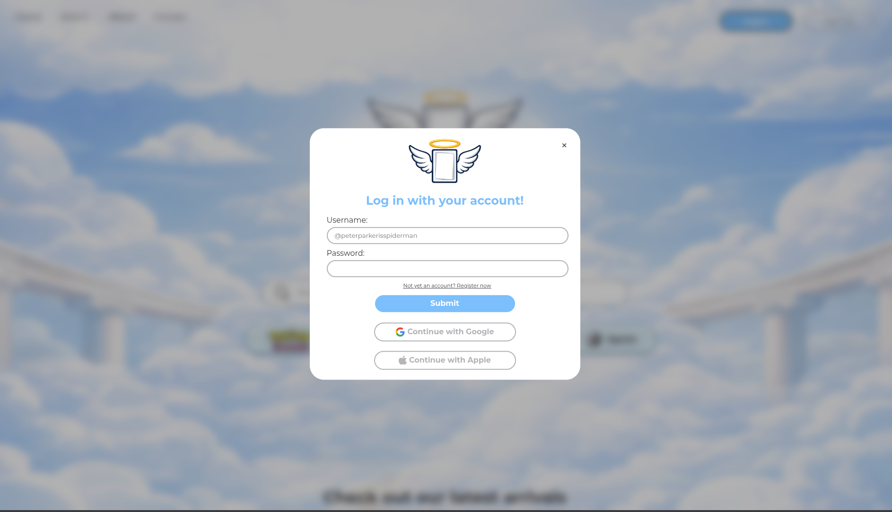
  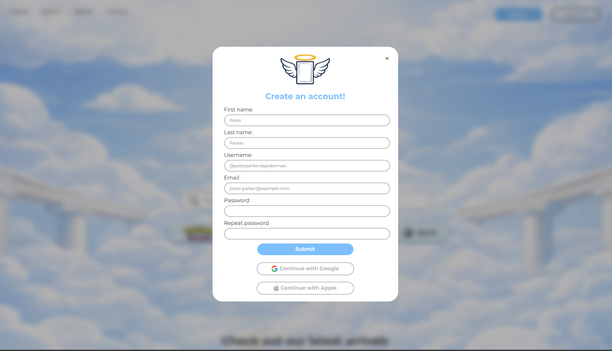

### Marketplace

  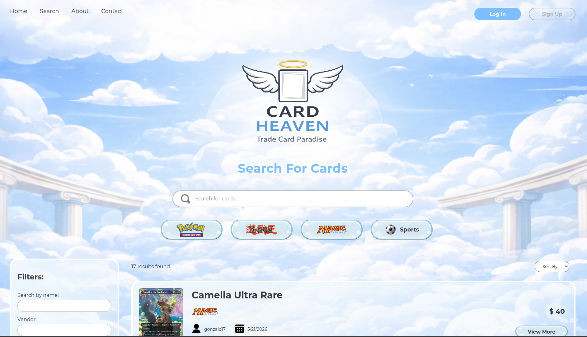
  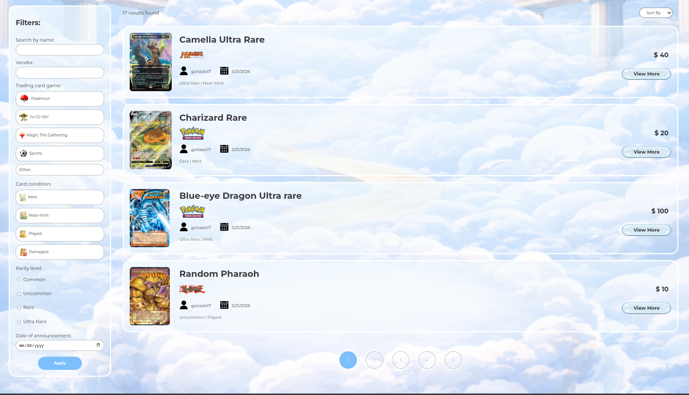
  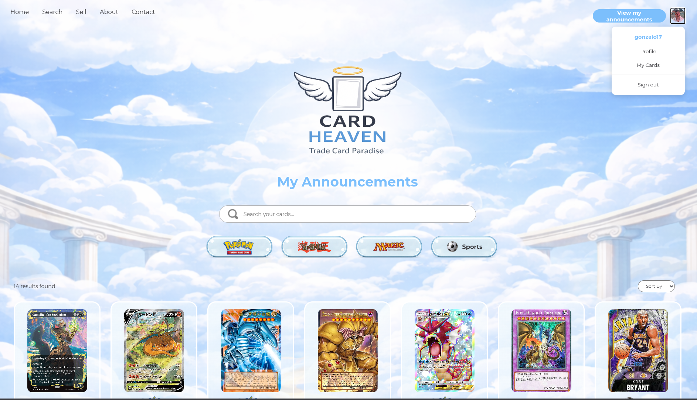

### Sell Card

  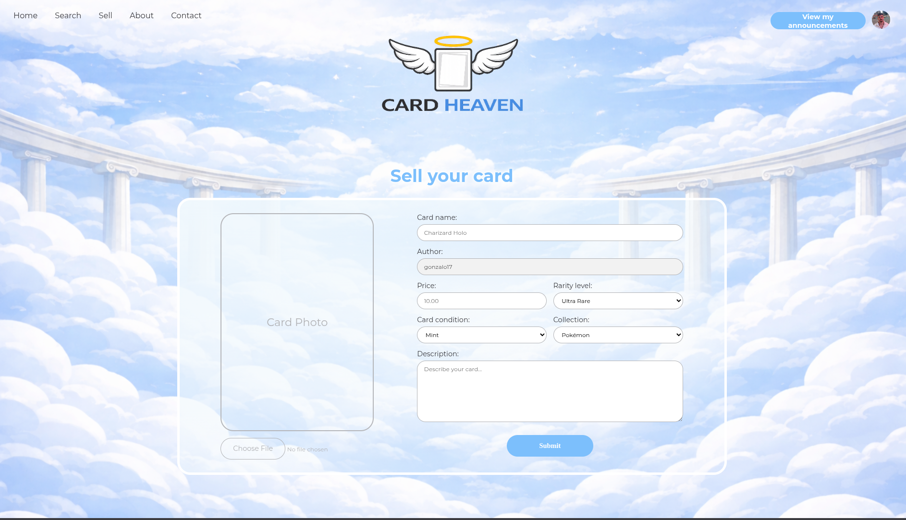

### User Profile

  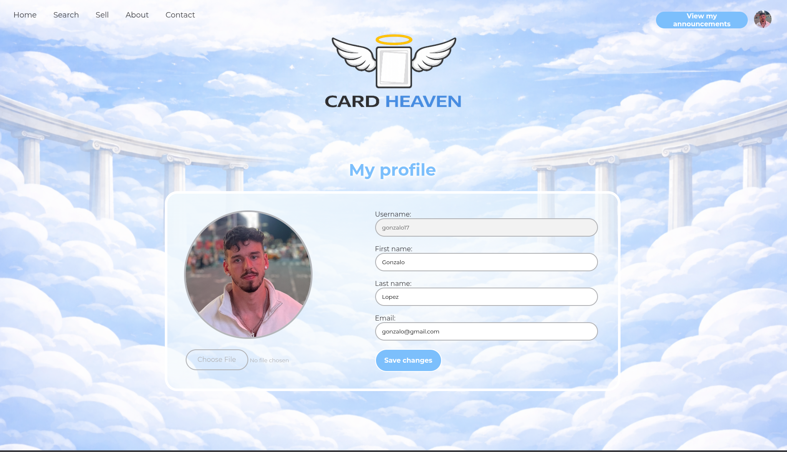

